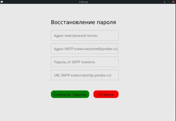

<h2>Handbook PhoneBook v.1.1</h2>

<h3>Requirements</h3>
    <li>Python3 (3.6-3.9)</li>
    <li>MySql (MariaDB)</li>
    
<h3>Installation</h3>
 <li>python -m pip --upgrade pip</li>
 <li>python -m pip install pipenv</li>  
 <li>pipenv install -r requirements.txt</li>
   
<h3>Data base MariDB</h3>

 <li>Field       Type         Null     Key     Default  Extra</li>                                                              
 <li>"id"        int(11)      NONULL   PRIKEY  NULL     AI   </li>                                                               
 <li>"name"      varchar(100) YES              NULL          </li>                                                              
 <li>"nomer"     char(12)     YES      UNI     NULL          </li>                                                              
 <li>"birthday"  date         YES              NULL          </li>                                                              

<h3>Data base load dump</h3>
<li>mysql  phonebook < phonebookdump.sql</li>

<h3>How to use</h3>
<li>python  main.py</li>

<h3>Tested on</h3>
    <li>Manjaro</li>
    <li>Debian</li>
    <li>Fedora</li>

<h3>Give it a Star</h3>
If you find this repo useful , 
give it a star so as many people can get to know it.

